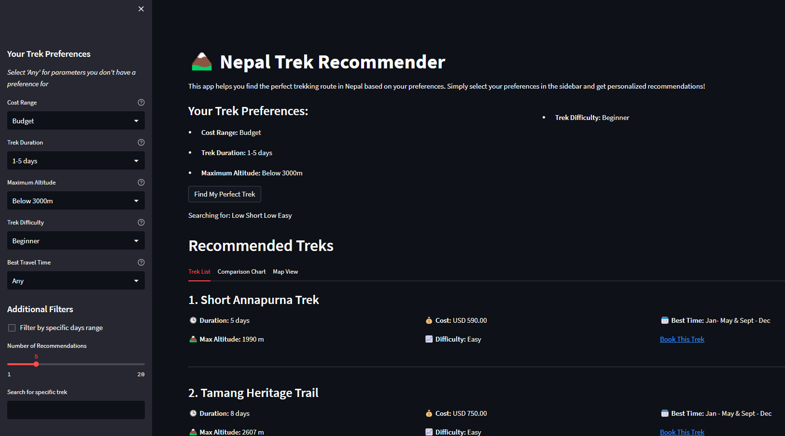

# TrekNepal

This project is a Trek Recommendation System that helps users find suitable trekking routes based on their preferences. The preferences include cost, duration, altitude, and difficulty level. The application uses a machine learning model to recommend treks that best fit the user's selected criteria.
## Features

- User Preferences Input: Users can input their preferences for cost, duration, altitude, and difficulty.
- Recommendations: The system provides trekking recommendations based on the user's preferences.
- Information Display: Displays detailed information about the recommended treks, including cost, duration, altitude, and difficulty level.


## Screenshots




## Installation

### Prerequisites
- Python 3.7 or higher
- Streamlit
- Pandas
- Scikit-learn


## Usage

```bash
  git clone https://github.com/yugratna19/TrekNepal
```

Install dependencies

```bash
  pip install -r requirements.txt
```


### Model training

The model training code is provided in the model.ipynb notebook. Run this notebook to train the recommendation model.

Train the model 

```bash
    jupyter notebook model.ipynb
```
Start the server

```bash
  streamlit run app.py
```


## Acknowledgements

 - [Nepal Treking Dataset](https://www.kaggle.com/datasets/bibekrai44/nepal-treking-dataset) for treaking dataset
